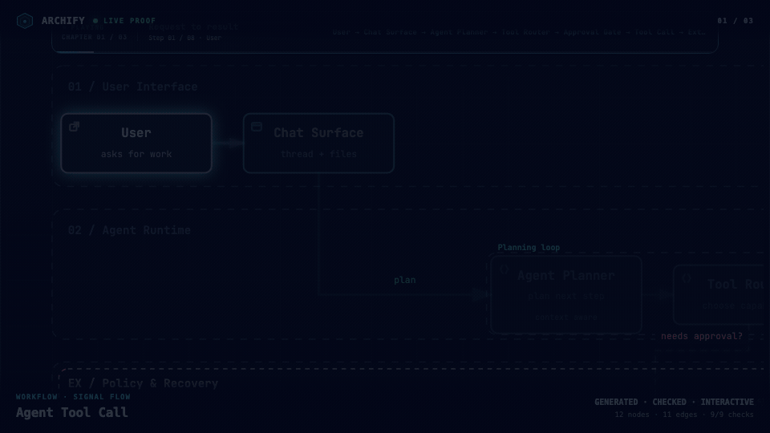

<p align="center">
  <strong>English</strong> · <a href="./README_ZH.md">简体中文</a>
</p>


# Archify

**Turn a codebase or system description into a polished, interactive system map — directly in chat.**

Archify is a Node.js rendering and validation system for Cursor, Claude Code, Codex CLI, and OpenCode. Agents produce typed JSON IR; Archify deterministically compiles it into HTML/SVG.

- **Open it and present** — five diagram types, four presets, dark/light themes, built-in brand marks, and finite motion
- **Review architecture changes before merge** — compare two validated snapshots as Before / Delta / After, with exact added, removed, changed, moved, and rerouted facts
- **Every interaction stays grounded** — search nodes, optionally open revision-verified source, trace upstream/downstream authored reach and exact routes, compare roles, and play guided stories without inventing topology
- **One file, ready to trust** — typed JSON IR and deterministic checks produce self-contained HTML plus PNG, SVG, WebM, and 1200×630 share cards

**Current development version:** `v2.17.0-dev.1`. See [Changelog](CHANGELOG.md#unreleased).

**No repository is required:** describe the system in any agent chat.

## This fork: archify-pure

A local-only build. Everything runs offline from the moment you clone it.

- **No update check.** The packaged updater that `GET`s a remote release manifest, and the `## Update awareness` step that invoked it, are removed. The Skill makes zero outbound requests.
- **No hosted docs site.** The GitHub Pages landing, guide, Proof Lab, and agent switcher pages are removed, along with their Google Fonts, Trendshift badge, and star-history chart.
- **No sponsor placements.**

The 11 verified gallery diagrams and their JSON sources stay in the repository as local fixtures, so `examples/*.html` and `docs/gallery/artifacts/*.html` open from disk with no network access.

## See Archify in action

These are generated Archify artifacts, not product mockups. Each link opens the local file.

<p align="center">
  
  <br/>
  <sub><strong>Three real generated artifacts.</strong> Signal Flow · Blueprint · Classic · sources in <a href="docs/gallery/sources/">docs/gallery/sources/</a></sub>
</p>

| Guided story | Route probe | Semantic lens |
|---|---|---|
| [](docs/gallery/artifacts/agent-tool-call.workflow.html?theme=dark&present=1&play=1#view=happy-path) | [](docs/gallery/artifacts/cache-miss.sequence.html?theme=dark&present=1#route=web~db) | [](docs/gallery/artifacts/production-deployment.architecture.html?theme=dark&present=1#lens=backend~database) |
| Play one finite named chapter. | Inspect the shortest authored directed path. | Compare real traffic between semantic roles. |

[`docs/gallery/artifacts/`](docs/gallery/artifacts/) holds all 11 checked-in scenarios, their JSON sources in [`docs/gallery/sources/`](docs/gallery/sources/), and their validation receipts.

### A real repository, mapped from source

[](docs/cases/mco-runtime.architecture.html?theme=dark&present=1#view=dispatch-path)

Archify traced [`mco-org/mco`](https://github.com/mco-org/mco) at `9f1a1cf` and produced this checked map. **[Open it ↗](docs/cases/mco-runtime.architecture.html?theme=dark&present=1#view=dispatch-path)** · [trace reach ↗](docs/cases/mco-runtime.architecture.html?theme=dark#focus=router&reach=downstream) · [typed source](docs/cases/mco-runtime.architecture.json)

## Preview

Same diagram, two themes, one click to switch:

| Dark | Light |
|---|---|
|  |  |

The Export menu copies PNG to the clipboard and downloads static or motion formats:


Use **Copy Share Card** when you want a canonical 1200×630 image for a README, release, or social post.

After tracing a route, **Export → Route Share Card** downloads that authored path as a 1200×630 PNG with the full diagram retained for context.


After tracing authored `Upstream` or `Downstream` reach, **Export → Reach Share Card** captures that exact reading without claiming runtime impact.


Open [`examples/web-app.html`](examples/web-app.html) locally to try the complete viewer.

## Quick start

### 1. Install

Install this Skill from the local checkout — copy the `archify/` directory into wherever your agent loads Skills:

```bash
cp -R archify ~/.claude/skills/archify      # Claude Code
cp -R archify ~/.agents/skills/archify      # Codex CLI
cp -R archify .claude/skills/archify        # project-local
```

Or extract the packaged [`archify.zip`](archify.zip) into your Skills directory; it yields an `archify/` folder.

No network access, no account, and no version probe are involved.

### 2. Start from a description — no repository required

```text
Use Archify to draw: Browser -> API -> Redis cache -> PostgreSQL fallback.
```

For source evidence, open a repository and ask:

```text
Analyze this repository, then use archify to create a high-level runtime architecture diagram.
Show 8–12 core components, one primary path, external dependencies, and trust boundaries.
Put supporting detail in cards instead of adding more edges.
```

### 3. Refine in chat

Continue with focused requests such as `add Redis`, `move auth to the left`, or `highlight the rollback path`. Archify keeps the typed source available for targeted iteration.

## Choose the right diagram

| Type | Best for | Include in your prompt |
|---|---|---|
| **Architecture** | Components, services, storage, boundaries | Scope, core components, primary path |
| **Workflow** | CI/CD, approvals, tool calls, runbooks | Participants, order, branches, exceptions |
| **Sequence** | API calls, cache fallback, auth, async traces | Callers, callees, returns, timing |
| **Data Flow** | Pipelines, lineage, PII, consumers | Sources, transforms, stores, boundaries |
| **Lifecycle** | States, retries, waits, terminal outcomes | States, events, retry and cancellation paths |

Architecture's optional `deployment-ownership` profile fails closed when authored owners, region placement, private database scope, or named crossings are missing; it is never implicit and does not inspect live infrastructure. See the checked deployment proof in [`docs/gallery/artifacts/production-deployment.architecture.html`](docs/gallery/artifacts/production-deployment.architecture.html).

For design or PR review, Architecture Delta compares validated Before / Delta / After snapshots with a machine receipt. Select an authored change or play one finite, viewer-only Review; it infers no impact, risk, or merge safety.

`node archify/bin/archify.mjs compare architecture base.json head.json architecture-delta.html --json`

[](examples/checkout-platform-delta.html)

Not sure which one fits? Ask the zero-dependency CLI:

```bash
node archify/bin/archify.mjs guide "Show an API request with Redis cache miss"
node archify/bin/archify.mjs guide "Map Kafka topics, consumer groups, replay, and DLQ" --json
```

Workflow keeps the happy path clear across lanes:


Sequence explains one interaction over time:


Data Flow makes movement and sensitivity boundaries explicit:


Lifecycle separates progress, waits, retries, and terminal outcomes:


Architecture examples: [`web-app`](examples/web-app.html) · [`Archify pipeline`](examples/archify-repo.html) · [`grid placement`](examples/archify-repo-grid.html) · [`desktop agent`](examples/maka-architecture.html)

## Why Archify

- **Layout judgment over generic auto-layout** — the agent chooses hierarchy, spacing, routes, and emphasis; shared automatic endpoints spread deterministically instead of piling arrows on one midpoint.
- **Typed JSON IR** — every renderer-backed mode has a schema and reproducible source.
- **Atomic validation before delivery** — schema, layout, HTML/SVG, route, and label-to-route clearance checks must all pass before a showcase artifact replaces the last known good output.
- **Failures come with a repair receipt** — `validate --json` and `deliver --json` return stable rule codes, the exact subject, measured evidence, and only supported repair controls instead of a Node stack or an unstructured retry guess.
- **Last-good live preview** — an optional desktop loop watches one JSON file, refreshes only after the latest candidate passes every gate, and keeps the previous verified diagram visible when a save is incomplete or invalid.
- **Truthful interaction** — focus, upstream/downstream reach, exact routes, role comparison, and stories reuse authored nodes and relationships instead of inventing topology or claiming runtime impact.
- **Source evidence, only when requested** — Evidence-backed Architecture nodes mark themselves `SRC n` and open Git-verified files and line ranges pinned to one commit; ordinary artifacts stay source-free.
- **Portable by default** — the result is one HTML file; exports remain full-diagram and free of temporary viewer state.

Archify is not a general-purpose drawing editor or a Mermaid theme. It turns technical intent into a communication artifact.

## How it works

| Step | What happens |
|---|---|
| **Generate** | The agent creates typed JSON IR from your description. |
| **Validate** | Bundled validators and layout rules check the source; failures identify the exact local repair in machine-readable JSON. |
| **Preview (optional)** | A loopback-only desktop session watches one source and reloads only verified revisions; failures keep the last-good artifact. |
| **Deliver** | A same-directory candidate is rendered and checked; only a passing artifact atomically replaces the target, then optional `--open` launches that exact file. |
| **Iterate** | The agent updates the source while unrelated structure stays stable. |

Useful repository commands:

```bash
cd archify
node bin/archify.mjs doctor
node bin/archify.mjs demo /tmp/archify-demo
node bin/archify.mjs guide "Show CI/CD checks, approval, deploy, and rollback"
node bin/archify.mjs validate workflow examples/agent-tool-call.workflow.json --quality showcase --json
node bin/archify.mjs preview workflow examples/agent-tool-call.workflow.json /tmp/workflow.html --quality showcase
node bin/archify.mjs deliver workflow examples/agent-tool-call.workflow.json /tmp/workflow.html --quality showcase --open --json
```

`preview` is an explicit loopback-only desktop mode: it watches one JSON file on a random `127.0.0.1` port, keeps the last verified output through failures, stops with Ctrl-C, and adds no generated-HTML runtime. Use `--no-open` for tests or manual URL opening.

`deliver --open` is an opt-in one-shot handoff after commit. Opener failure preserves success; JSON remains on stdout and the absolute fallback path goes to stderr.

On failure, `validate --json` and `deliver --json` emit one JSON object. Apply only each `diagnostics[]` subject's `supportedFixes`, within the Skill's two correction rounds; visual review remains separate.

Settings:

```json
{
  "meta": {
    "locale": "en",
    "animation": "trace",
    "visual_preset": "signal-flow"
  }
}
```

`meta.locale=en|zh-CN` localizes page title, Legend, states/errors, a11y, HTML/SVG `lang`—never authored content. Otherwise omit; preserve requested-language copy; disclose English fallback. Static omits `animation`; `classic` defaults.

## Explore and share the output

| Action | Control |
|---|---|
| Open the factual Diagram Guide | <kbd>?</kbd> |
| Find and focus a semantic node | <kbd>/</kbd> |
| Trace upstream/downstream authored reach | Focus a node → `Upstream` / `Downstream` |
| Probe a directed route and inspect its journey | <kbd>R</kbd> or `PATH` |
| Compare one or two semantic roles | <kbd>L</kbd> or `LENS` |
| Open the live overview radar | <kbd>M</kbd> or `MAP` |
| Play a guided story / change chapter | <kbd>P</kbd> / <kbd>[</kbd> <kbd>]</kbd> |
| Enter Presentation Stage | <kbd>F</kbd> |
| Choose visual style (`S` cycles) / toggle theme / open Export | <kbd>S</kbd> / <kbd>T</kbd> / <kbd>E</kbd> |
| Zoom or reset | <kbd>+</kbd> / <kbd>-</kbd> / <kbd>0</kbd> |

Stable links can restore `#focus=<id>`, `#focus=<id>&reach=upstream|downstream`, `#relation=<id>`, `#route=<source>~<target>`, `#lens=<kind>~<kind>`, and `#view=<view-id>`. Reader-driven motion is finite, respects `prefers-reduced-motion`, and never enters canonical exports.

The complete generation and viewer contract lives in [`archify/SKILL.md`](archify/SKILL.md).

## Reference and scope

- [Schema reference](archify/schemas/README.md) · [Skill](archify/SKILL.md) · [Examples](archify/examples/) · [Agent cookbook](docs/authoring-cookbook.md)
- [Changelog](CHANGELOG.md)
- [Roadmap](ROADMAP.md)

Automatic Mermaid parsing, general-purpose auto-layout, hosted sharing, and WYSIWYG editing are intentionally outside the current scope.

## License

[MIT](LICENSE) — free to use, modify, and distribute. Archify derives from `Cocoon-AI/architecture-diagram-generator` (MIT). The bundled vendor logos are trademarks of their owners; see [third-party notices](THIRD_PARTY_NOTICES.md).
